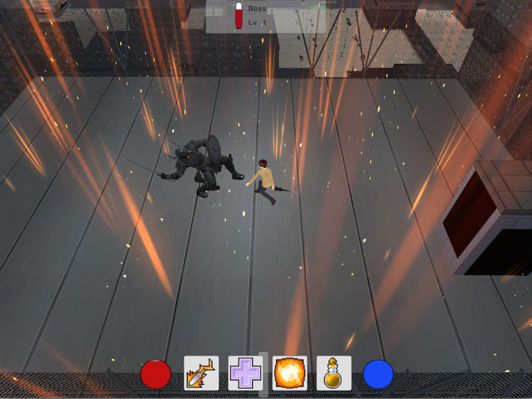
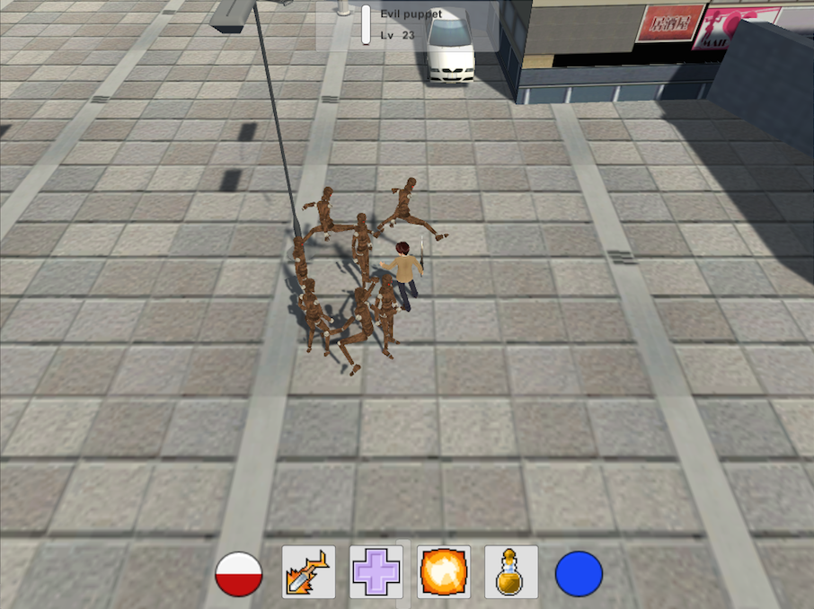

# -Unity-3D-_Hack_n_Slash
A 3D hack n slash made with unity.

Made in 4 days in a team of two. Lots of functionalities were required in this school project. Basically, it is a classic hack'n slash, as would be Diablo 3 or Torchligt. All classic functionalities of hack n slash are implemented here; such as a stat based character, enemies, and combat, but also more complex things, such as skills. 7 skills have been made here, including a ground targeted skill, an aoe damage skill, a passive skill, or again a classic distant damage skill.
Loots were implemented as well: enemies drop weapons that the player can store and equip, changing its statistics and animations.

Technically speaking, every major aspect of Unity development was used in this game. Every game system is C# hand-scripted, using every technique available in unity C# scripting, that are for example singletons, and coroutines. Many coroutines have been implemented in this project, around twenty, to relieve the maximum stress possible on updates calls.

Every asset in this game are free assets from the Unity asset store, or found on the web. This includes 3d models, animations, particle effets, musics, sounds, and UI sprites.

Game controls:
- Click on an enemy to attack it.
- I: inventory screen (equip weapons)
- C: character screens (stats and point allocation)
- K: skill panels. Drag skills in slots to activate them.
- 1, 2, 3, 4: use skills.
- Y: Cheat key: gives one level.
- U: Cheat key: drops a weapon.
